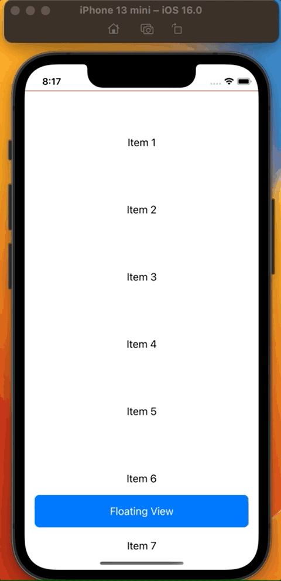

# HideFloatingViewWhenListScrollingDown 

Using `ScrollViewReader`, `GeometryReader` along with `CoordinateSpace`, and `PreferenceKey` protocol ,
we can detect the scroll direction of scroll view.
Based on this scroll direction, we can change any state property of the SwiftUI view.

# Preview

	

